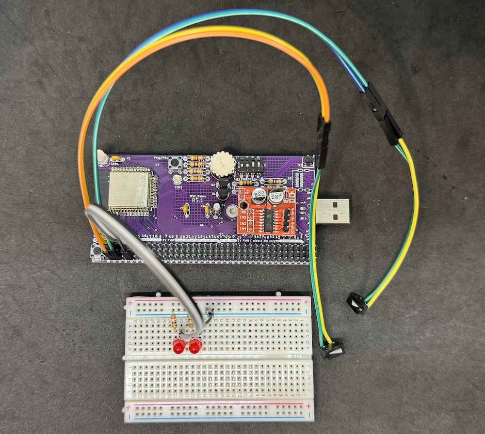

# Lab 2

## Objectives

The objective of this laboratory assignment is to investigate how the ESP32 microcontroller can be interfaced with simple digital and analog sensors (i.e., limit switch, pushbutton, and potentiometer) and be programmed to drive some common actuators (i.e., RC servo motor, DC gearmotor) using modulated square waves. Interrupt are used thoroughout, allowing the to respond to asynchronous external events. 

By the end of the lab each student should:

1. Understand the operation and use of external interrupts and interrupt service routines
3. Be able to interface with simple sensors
2. Be able to operate an RC servo motor
4. Be able to operate a DC motor bidirectionally using an H-bridge motor driver
5. Understand how to produce pulse-width modulated output for motor control with an ESP32
6. Understand the operation and use of quadrature encoders
7. Understand how external interrupts and interrupt service routines can be used to capture encoder pulses and determine the direction of rotation
8. Be familar with the operation and limitations of a simple set-point PID controller
9. Develop a further understanding of using git for version control

### Hardware Required

For this lab, you will require the MSEduino board that was assembled in Lab 1, along with other conponents found in the MSE 2202 Lab Kit. These include:

* MSEduino ESP32-S3 based development board
* Modular solderless breadboard
* Micro limit switch ⨉ 2
* 5 mm LED ⨉ 2
* 390 Ω 1/4 W resistor ⨉ 2
* SG90 RC servo motor ⨉ 2
* Geared mini DC motor
* MX1508 dual DC motor driver
* Jumper or Dupont wires (M–F) to connect components

### Build and Flash

Open the [Arduino IDE](https://www.arduino.cc/en/software) and configure it for the ESP32. Use a USB-A extension cable to connect your MSEduino to your computer. Use the **Tools→Board→esp32** menu to select the **Adafruit Feather ESP32-S3 No PRAM board**. The Port should be set as **COMx** on Windows or **dev.cu.usbmodel14101** (or similar) on Mac. The code provided with this lab requires version 2.0.11 of the Arduino-ESP32 boards. Use the **Tools→Board→Boards Manager...** menu and find the **esp32 by Espressif** board package. Confirm that the version is **2.0.11**. If necessary, use the dropdown menu to change versions. The code will not work in versions 3.0+ due to changes made to the underlying esp-idf API.

#### VSCode and PlatformIO

Note that as an alternative to the Arduino IDE, this project can be developed using [VSCode](https://code.visualstudio.com) with the [PlatformIO IDE](https://platformio.org/platformio-ide) extension and the [Espressif 32 platform](https://registry.platformio.org/platforms/platformio/espressif32) installed.

### Library Installation

In order to compile properly, the code in this repository requires the following library to be installed:

#### Adafruit NeoPixel

The [Adafruit NeoPixel Library](https://github.com/adafruit/Adafruit_NeoPixel) is a third-party library that can be installed directly from the Arduino IDE Library Manager. Go to **Tools→Manage Libraries...**. Use the search box to find and install the AdaFruit NeoPixel library.

For users of VSCode/PlatformIO, a dependancy for the Adafruit NeoPixel library is contained in the `platformio.ini` configuration file [MSEduino-R51-Test](https://github.com/MSE2202/MSEduino-R51-Test) repository. This will automatically install the library, if necessary.

## Exercise
You will need to have [git](https://git-scm.com) installed on your computer for all lab exercises. You can [download](https://git-scm.com/downloads) and install git if it is not already on your computer. If git exists on your computer, use `git --version` to check that it is a relatively recent version and upgrade if necessary. Note that while many graphical interfaces for git are intuitive and convenient to use, you are encouraged to interact with git on the command line, at least until the standard git workflow is fully understood. 

Alternatively, you may use a graphical user interface such as [SourceTree](https://www.sourcetreeapp.com) or [other GUI](https://git-scm.com/downloads/guis), with the exception of [GitHub Desktop](https://desktop.github.com), which does not work properly with the GitHub Classroom that will be used to submit your code for each exercise. **Classroom repositories that do not show commits (as often happens with the use of GitHub Desktop) will receive a grade of 0**. 

 1. Build the circuit shown below with a single limit switch (LS1) connected to GPIO4. The ground connection can use any bottom (outside) pin on the MSEduino ground rail.

    
    
 
   Clone this repository and checkout the **exercise1** branch. Find the example sketch **Lab2.ino**, which is located in the [Lab2](Lab2) folder. Upload it to the MSEduino and confirm that, with S1-4 set to the ON position, the built-in SmartLED (GPIO21) is pulsing with a "heartbeat" at an even interval. Open the Serial Monitor and configure the baud rate to 115200. Press the limit switch multiple times and notice how the "press" count increments. A [GPIO interrupt](https://docs.espressif.com/projects/arduino-esp32/en/latest/api/gpio.html#interrupts) is used to capture button presses. Since the interrupt service routine (ISR) does not account for mechanical noise in the switch, single presses often result in the count incrementing by more than one. Confirm that this is the case.
   
2. Checkout the **exercise2** branch. Upload the new version of the sketch to the MSEduino. Open the Serial Monitor and observe how the "press" count increments with each button press. Perform a ``diff`` of the two sketches to see how the software debounce is implemented.

   Note that it *may* be necessary to adjust the value of ``cDebounceDelay`` for proper operation.

3. Add a second limit switch (LS2) connected to GPIO5 and two LEDs connected to GPIO6 (LED1) and GPIO7 (LED2) to the circuit, as shown in the schematic below. Use a modular solerless breadboard for the LEDs and associated resistors. Ensure that there is a ground connection from the MSEduino to the solderless breadboard as well.
   
   
   
   
   Create a new branch, named **exercise3**, and switch to it. Modify the sketch from Exercise 2 so that independent counts are maintained for the two limit switches. In addition, the state of the LED1 should should toggle each time LS1 (connected to GPIO4) is pressed. Similarly, LED2 should toggle each time LS2 (connected to GPIO5) is pressed. Note that both limit switches should be debounced and require pullup resistors. Once everything is working properly, commit your changes and push your repository back to GitHub. Show your operating circuit to a TA before proceeding to the next exercise.

4. Build the circuit shown below with an SG90 RC servo motor connected to GPIO41. *Do not disconnect any of the components used for Exercises 1–3.* The signal or pulse line (orange lead) of the RC servo is connected to GPIO41, the red lead is connected to +5 VDC, and the brown lead is connected to ground. All of these connections can be made directly on the MSEduino; however, you will need to use 3 M–F Dupont wires to break out the connections. This will allow you to connect an oscilloscope to the signal wire and observe the control signal. Enable the built-in potentiometer connected to GPIO1 (ADC1-0) by setting S1-3 to the ON positon.

   
   

    Checkout the **exercise 4** branch. Note that this will change the contents of the **Lab2.ino** sketch. Upload it to the MSEduino and confirm that the built-in "heartbeat" LED pulses at an even interval and that the RC servo sweeps through its full range of motion (0° to 180°) as the potentiometer is turned. Note that the duty cycle constants in the function `degreesToDutyCycle()` may need to be adjusted slightly to achieve 0° and/or 180°. 
   
   The example sketch uses the [LED Control (LEDC)](https://docs.espressif.com/projects/arduino-esp32/en/latest/api/ledc.html) peripheral to produce the pulse-width modulated signal used to control RC servos since the standard Arduino Servo library does not work with the ESP32. Connect an [oscilloscope](https://learn.sparkfun.com/tutorials/how-to-use-an-oscilloscope/all) to GPIO41 on the solderless breadboard (be sure to also connect the probe ground to the common ground) to observe the control signal. Note how the period and duty cycle changes as the servo shaft rotates. Add a comment starting at Line 101 (you can add as many lines as necessary) that describes the RC servo signal and how it varies with shaft position. Commit your changes and push your repository back to GitHub. Show your operating circuit to a TA before proceeding to the next exercise.

5. Create a new branch, named **exercise5**, and switch to it. Modify the sketch from Exercise 4 use the state of PB1 on the MSEduino (connected to GPIO0) to control the position of the RC servo motor. Note that the pushbutton is connected to ground and the internal pull-up resistor for GPIO0 should be activated by using the ``INPUT_PULLUP`` mode of the [pinMode()](https://www.arduino.cc/reference/en/language/functions/digital-io/pinmode/) function to prevent a floating input value when the button is not pressed. For this exercise, interrupts are not necessary to capture the state of the pushbutton. The `digitalRead()` function is sufficient.
   
   When the pushbutton is not pressed the RC servo motor position should be ~30° and when pressed it should be ~150°. Once everything is working properly, commit your changes and push your repository back to GitHub. Show your operating circuit to a TA before proceeding to the next exercise.

A demonstration of Exercise 5 may be seen in the video below.

6. Add an MX1508 DC motor driver and DC gearmotor to the circuit, as shown in the schematic below. *Do not disconnect any of the components used for Exercises 1–5.* The MX1508 connects directly to the MSEduino, supplying it with 5 VDC. IN1 is connected to GPIO35 and IN2 is connected to GPIO36. Connect the M1 (white) wire and M2 (red) wire to the MOTOR-A pins on the MX1508. Connect C1 (green wire) to GPIO15 and C2 (yellow wire) to GPIO16. The encoder VCC (black wire) should be connected to 3.3 VDC and GND (indigo wire) to ground. All wire colours refer to those at the motor—the extensions soldered in Lab 1 will likley be different colours. **Be very careful to not connect the encoder VCC to 5 VDC.** 
 
   
   
 
 Checkout the **exercise 6** branch. Note that this will change the contents of the **Lab2.ino** sketch. Upload it to the MSEduino and confirm that the built-in "heartbeat" LED pulses at an even interval. Pressing PB1 will update the target position (in encoder counts) for the motor, toggling between 0 (starting angle) and `cCountsRev` (= 1096) for a full rotation. The result is that the motor will change direction with each button press. Subsequent button presses can occur immediately (i.e., the target is updated whether it has been reached or not). 
 
 The MX1508 DC motor driver contains two H-bridges that allow the speed of two motors to be driven both clockwise and counterclockwise. The speed of the motor is proportional to the duty cycle applied to the motor control pins (IN1 and IN2 for Motor A) as follows: 
   
   | Direction | IN1 | IN2 |
   |-----------|:---:|:---:|
   | Forward   | PWM | 0   |
   | Reverse   | 0   | PWM |
   | Stop      | 0   | 0   |
   
   where PWM is a pulse-width modulated control signal sent to either IN1 or IN2. Higher duty cycles result in faster speeds. Again, the LEDC peripheral is used to produce the pulse-width modulated signal. Use 2 channels of an oscilloscope to observe how the control signals vary with the motor speed and direction. Add a comment starting at Line 188 (you can add as many lines as necessary) that describes the signals sent to the MX1508 and how they vary with motor speed and direction. Commit your changes and push your repository back to GitHub. Show your operating circuit to a TA before proceeding to the next exercise.
   
7. Using your modular solderless breadboard as a base, place 3 gecko dots similar to below. The goal is to have the gearmotor centred on the breadboard and the limit switches in line, perpendicular to the motor shaft.
    
   

Remove the backing from the gecko dots and affix the geat motor to the centre of the breadboard and the limit switches in line with the shaft. Orient the limit switches so that the high part of the tab is towards the motor shaft

   

Secure a small black zip tie (**don't use the long one in your kit**) to the motor shaft. Trim the zip tie such that it is long enough to engage the limit switches without being any longer than necessary.

   

The complete schematic for the circuit is:
   
   

Checkout the **exercise7** branch and switch to it. The code implements manual control of the motor shaft position using the potentiometer. The range of the potentiometer is mapped to about half a revolution. If the motor needs to be rotated further, the PB1 can be used to further rotate the shift and update the centre point of the pot range. The additional rotation is proportional to how far the pot is from the centre point. The further from centre that it is, the more the shaft will rotate with each button press. 

After verifying the manual mode, modify the sketch such that the gearmotor can be calibrated and automatically controlled. The operating details are:
   * The two-position switch SW1 (S1-1) connected to GPIO3 is used to select between manual and auto mode. Note that the switch only connects to ground. The internal pullup resistor on GPIO3 needs to be enabled.
   * The system starts in manual mode.
   * In manual mode, the potentiometer and PB1 control the forward and reverse rotation of the shaft, as they do in the provided code.
   * When switched to auto mode, the operation of the push button changes. PB1 starts the calibration process. The motor should turn until it engages with LS1, connected to GPIO4. It will then reverse direction until it engages LS2, connected to GPIO5. The motor will then move to a position that corresponds to the position of the potentiometer connected to ADC1-0. It is now calibrated. Afterwards, it should continue to follow any changes in potentiometer position. **HINT**: Record the motor position (encoder count) when LS1 and LS2 are pressed and map this to the range of ADC1-0.
   * LED1 should be turned on when either limit switch is engaged.
   * LED2 should be turned on when the system is in auto mode but not calibrated.

A demonstration of Exercise 7 may be seen in the video below.

8. Create a new branch, named **exercise8**, and switch to it. *Merge* your code from Exercise 5 and Exercise 7 (Hint: you will likely have to resolve conflicts). The result should be a sketch controls both the DC gearmotor and RC servo motor simultaneously, with PB1 controlling the RC servo and the potentiometer and limit switches controlling the DC gearmotor. Show your operating circuit to a TA. If you have not done so already, be sure to __*push your respository back to GitHub*__.  __**Failure to do so will result in a grade of 0 for the lab.**__

A demonstration of Exercise 8 may be seen in the video below.

#### BONUS 

- Once again, checkout the **exercise6** branch. Create a new branch, named **bonus** and switch to it.  While the Serial Monitor may be used to observe the motor operating parameters, this exercise will use a much more powerful tool called [Serial Studio](https://serial-studio.github.io). You will have to download and install Serial Studio on your computer. Launch the application and configure it to visualize the target position, actual position, and position error for both motors, as follows:

   1. Click the "Select project file..." button in the Setup pane. Navigate to your cloned repository and select **lab2-serial-studio-dashboard.json**. This will load a preconfigured dashboard that plots the motor positions and errors.
   2. Ensure that the baud rate is set to 115200.
   3. Select the correct COM port (same as used for programming—make sure that the Arduino IDE (or other GUI/IDE) is not monitoring the serial port).
   4. Click the green "Connect" button at the top right.
   5. Click the "Dashboard" button at the top left.
   
   

   Again, Pressing PB1 will update the target position (in encoder counts) for the motor, toggling between 0 (starting angle) and `cCountsRev` (= 1096) for a full rotation. Subsequent button presses can occur immediately (i.e., the target is updated whether it has been reached or not). Observe the response of the DC motor. When finished, press the red "Disconnect" button at the top right to release the serial port. This will allow new code to be uploaded to the ESP32. If desired, the PID gains `kp`, `ki`, and `kd` can be altered to observe the impact on performance. 

   Note that, the raw data sent to Serial Studio can be observed by clicking the "<> Console" button at the top left. The dashboard configuration can be adjusted by clicking the "{} JSON Editor" button at the top right. Serial Studio also allows all data to be saved to a .csv file. Further information may be found [here](https://github.com/Serial-Studio/Serial-Studio/wiki)

### Other Things to Explore

1. What is the smallest angular resolution that can be achieved by the RC servo motor? How quickly can it move? 
2. Use a multimeter to determine the conditions that maximize current draw for each motor, as well as during simultaneous operation. Is it higher when the motors are starting up, running at full speed, loaded or unloaded? Given both the peak and average current draw, how long would a fully-charged 1000 mAh battery last?
3. The DC gearmotor is rated for 100 rpm when supplied with 6 VDC. How fast does it turn at 5 VDC? How is the speed affected by load?
4. For Exercises 6–8, adjust the value of `cMaxChange`. What happens when it gets to high?

## Resources

* [Arduino Language Reference](https://www.arduino.cc/reference/en/)
* [Arduino-ESP32 GPIO API](https://docs.espressif.com/projects/arduino-esp32/en/latest/api/gpio.html)
* [GPIO Peripheral Reference](https://docs.espressif.com/projects/esp-idf/en/latest/esp32/api-reference/peripherals/gpio.html)
* [Arduino-ESP32 LEDC API](https://docs.espressif.com/projects/arduino-esp32/en/latest/api/ledc.html)
* [LEDC Peripheral Reference](https://docs.espressif.com/projects/esp-idf/en/latest/esp32/api-reference/peripherals/ledc.html)
* [Serial Studio home](https://serial-studio.github.io)
* [Serial Studio Wiki](https://github.com/Serial-Studio/Serial-Studio/wiki)
* [Resistor Colour Code Guide](https://www.digikey.ca/web%20export/mkt/general/mkt/resistor-color-chart.jpg)
* [SG90 RC Servo Motor Data Sheet](http://www.ee.ic.ac.uk/pcheung/teaching/DE1_EE/stores/sg90_datasheet.pdf)
* [G12-N20-100 Geared Mini DC Motor](https://www.handsontec.com/dataspecs/motor_fan/GA12-N20.pdf)
* [G12-N20-100 Specifications](docs/GA12-N20_specs.png)
* [MX1508 Dual DC Motor Driver](https://components101.com/modules/mx1508-dc-motor-driver-pinout-features-datasheet)

## Evaluation

| Task       | Maximum Marks | Demo | Code | Comments |
|:-----------|:-------------:|:----:|:----:|:--------:|
| Exercise 1 | **5**         | 5    | —    | —        |
| Exercise 2 | **5**         | 5    | —    | —        |
| Exercise 3 | **15**        | 8    | 4    | 3        |
| Exercise 4 | **10**        | 5    | —    | 5        |
| Exercise 5 | **20**        | 10   | 5    | 5        |
| Exercise 6 | **10**        | 5    | —    | 5        |
| Exercise 7 | **25**        | 13   | 6    | 6        |
| Exercise 8 | **10**        | 5    | 5    | —        |
| BONUS      | **10**        | 5    | –    | 5        |